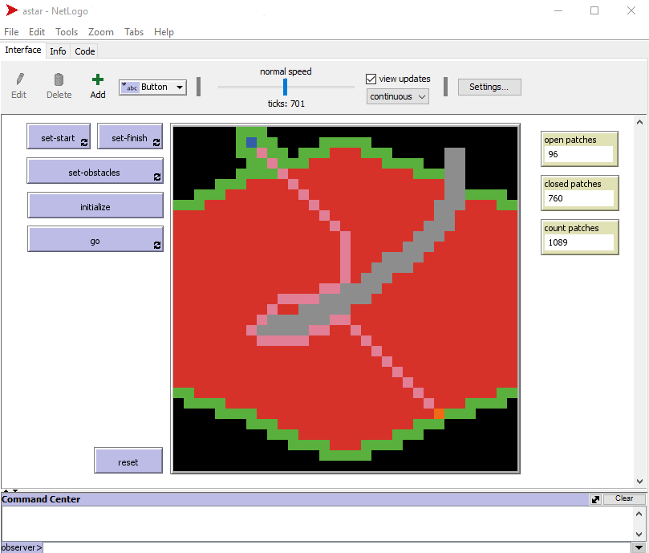

# astar-netlogo

This is an implementation of the A* pathfinding algorithm in NetLogo adapted from Sebastian Lague's excellent youtube series on the [algorithm](https://www.youtube.com/watch?v=-L-WgKMFuhE).   

## Running the model
1. Set a start patch (one blue patch)
2. Set an end patch (one orange patch)
3. Optionally, add some obstacles (zero or more gray patches)
4. Press initialize button
5. Press go. The model will halt when the optimal path is found. The optimal patch is retraced using pink patches.

  Note: This model doesn't currently account for impossible scenarios (i.e. surrounding the start patch with an obstacle wall).

